# Nunchuk64

I made an adapter enabling me to plug a Nunchuk into a Commodore 64.

## Micro controller

- I needed a micro controller on a small form factor PCB.
- It must be 3V3 to be compliant with the Nunchuk.
- It must have I2C. 
- It would be good if it had an on-board 5V to 3V3 regulator.
- It must have 5 output pins (in addition to the two I2C pins).
- A signaling LED would be nice.
- Arduino compatibility would be nice.

I picked the [ESP32-C3 SuperMini](https://www.aliexpress.com/item/1005007539612437.html)
which is 18×22mm²:

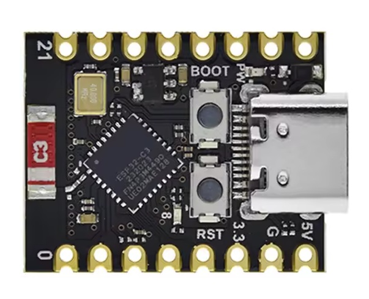

This is the [firmware](../../examples/nunchuk64).
At this moment C and Z both fire, maybe I'll make Z into an auto fire button.

## Schematics

The ESP32 obtains the JoyX and JoyY via I2C from the Nunchuk.
It also obtains the C and Z button status.

The  obtained values are mapped to 5 GPIO pins.

I used N-channel MOSFETS as level shifters to mimic a switch that connects one of the 5 joystick pins to ground.
The schematics below shows it once, for the fire button.

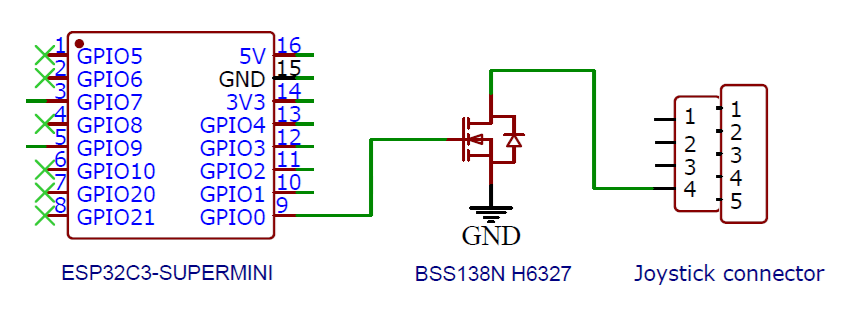

This is the full [schematics](Nunchuk64_schem.pdf) and the [EasyEDA sources](Nunchuk64_schem.json).

Always tricky: the pinout of the connector and the plug.

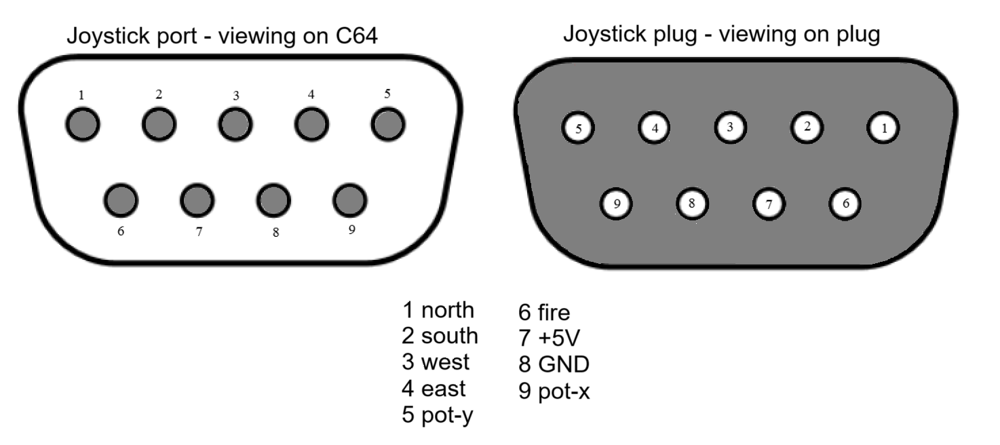

## Layout

I wanted the PCB to be small. Therefore, I placed the ESP on one side, and the MOSFETS on the other side of the PCB.

I'm not yet sure if I will solder the ESP board directly on my board (castellated pads).
Very likely I will raise it a bit to keep the USB connector reachable.

For the Nunchuk connector I used the trick I saw at [Adafruit](https://learn.adafruit.com/adafruit-wii-nunchuck-breakout-adapter).
The PCB is shaped into a connector, with a mechanical lock. I hope I got the PCB dimensions correct.

Of course the C64 cable should attach to the PCB from one side, and the Nunchuk cable from the other side of the PCB.
Since I might want to reuse this PCB for a PC-Nunchuk adapter, the "PC cable" (USB) should be on the same side as the C64 cable.

This is the layout [front](Nunchuk64_pcb_front.pdf)/[back](Nunchuk64_pcb_back.pdf) and the [EasyEDA sources](Nunchuk64_pcb.json).
Here are some renders

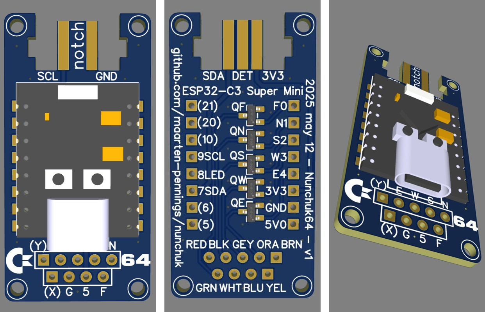

This is the [Gerber](Nunchuk64_gerber.zip) I sent to [JLCPCB](https://jlcpcb.com/DMP)

The un-assembled PCB arrived in 8 days.

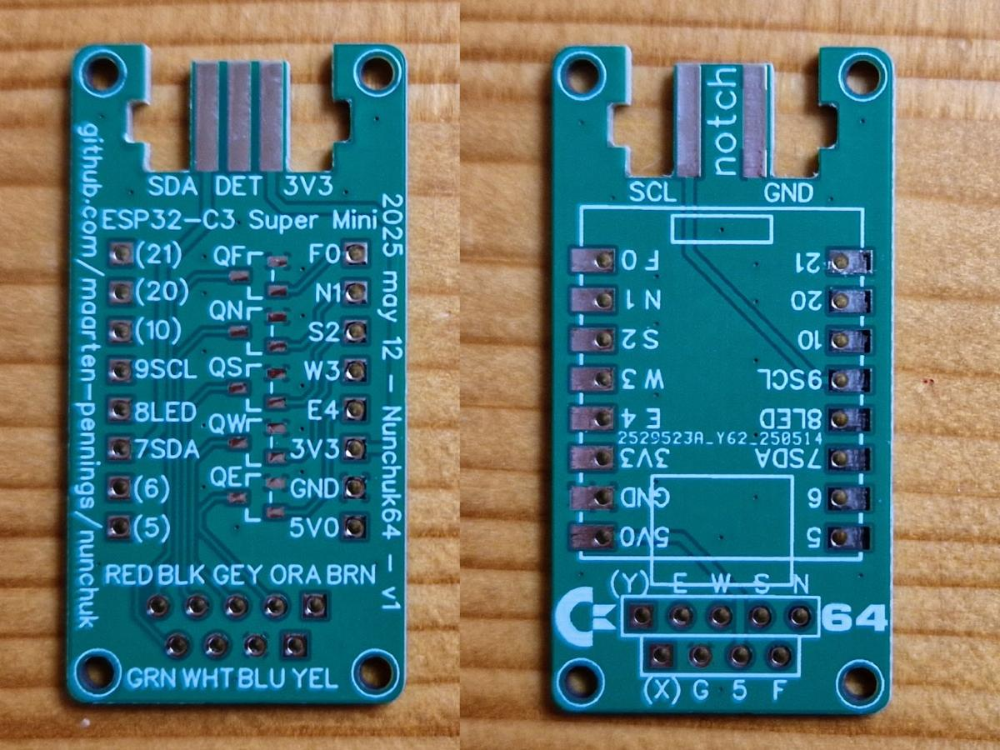

## Assembly 

Next step was assembly.
The ESP32 is raised a bit (by placing a credit card under it) so that
I can still plug in a USB connector.

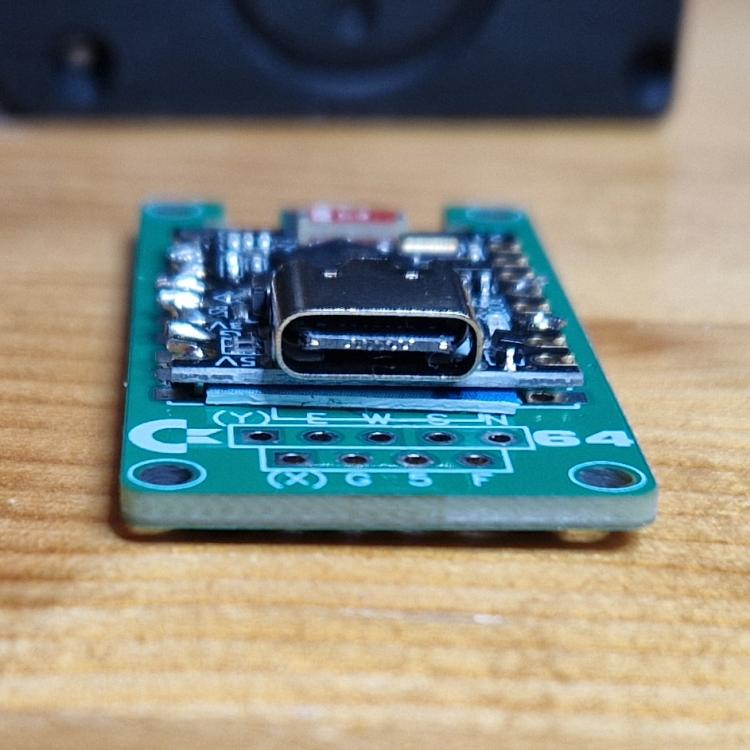

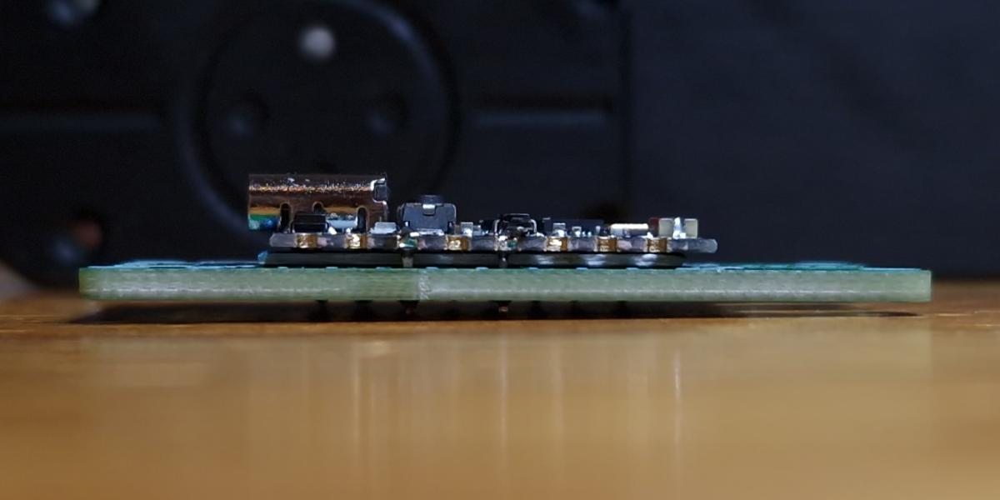

Next come the five MOSFETs and then the joystick cable.

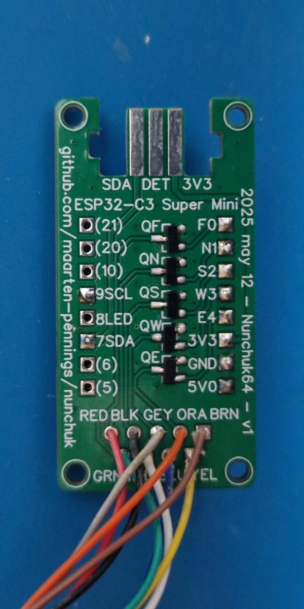

This is the complete assembly.

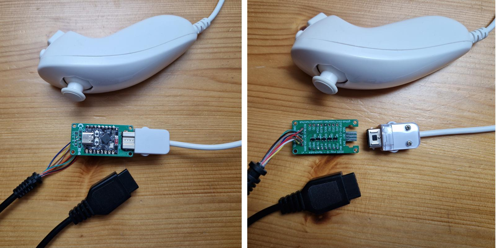

Then designing a two-part case: [floor](Floor.stl) and [roof](Roof.stl).

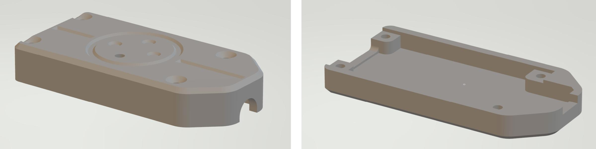

Below the filament printed result

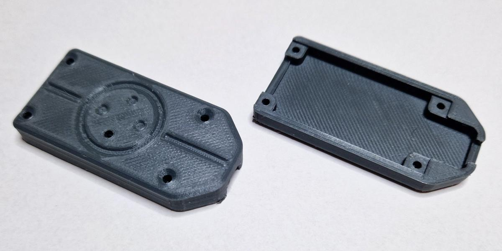

### First sample

The "end-product" fully assembled and encased.

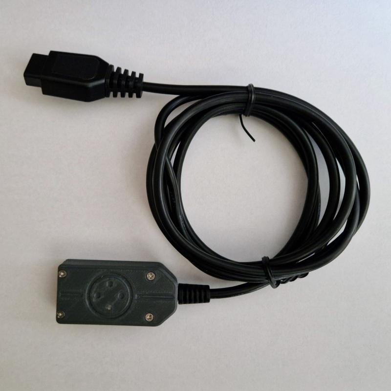

With the Nunchuk connected.

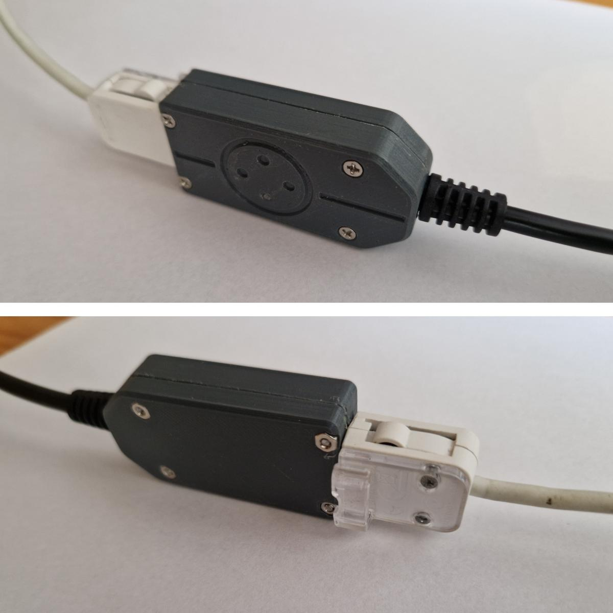

The blue LED flashes on power-up and when one of the five joystick functions is activated.

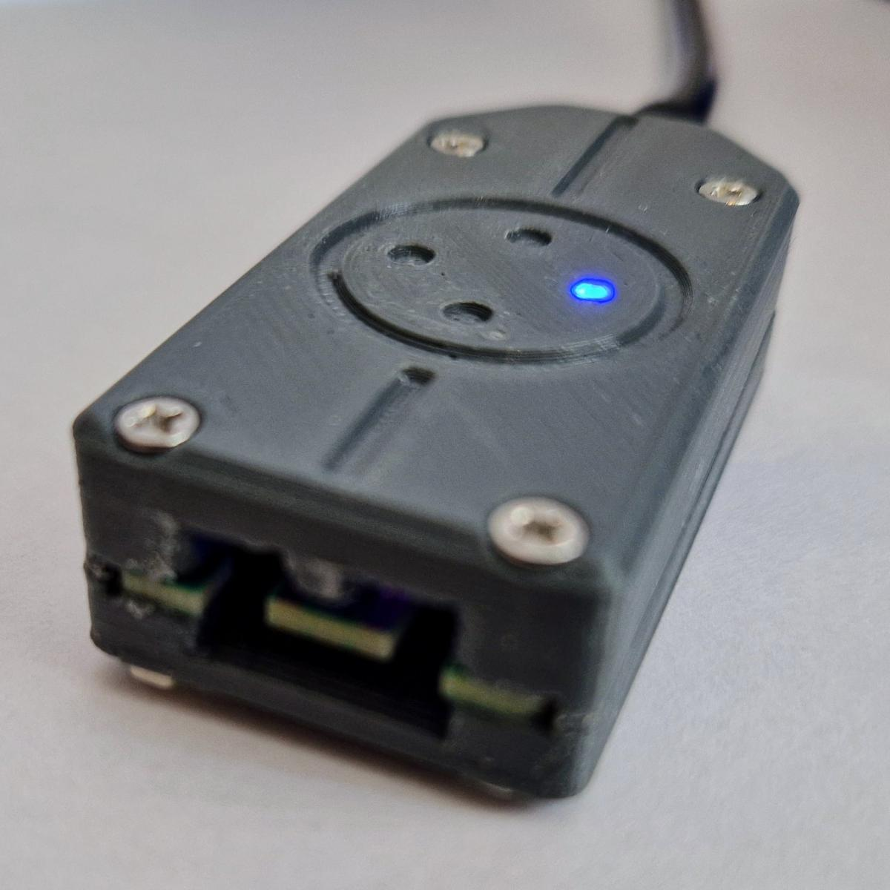

### Second sample

I made a second one: fully black and the case 3D printed with an SLA printer.

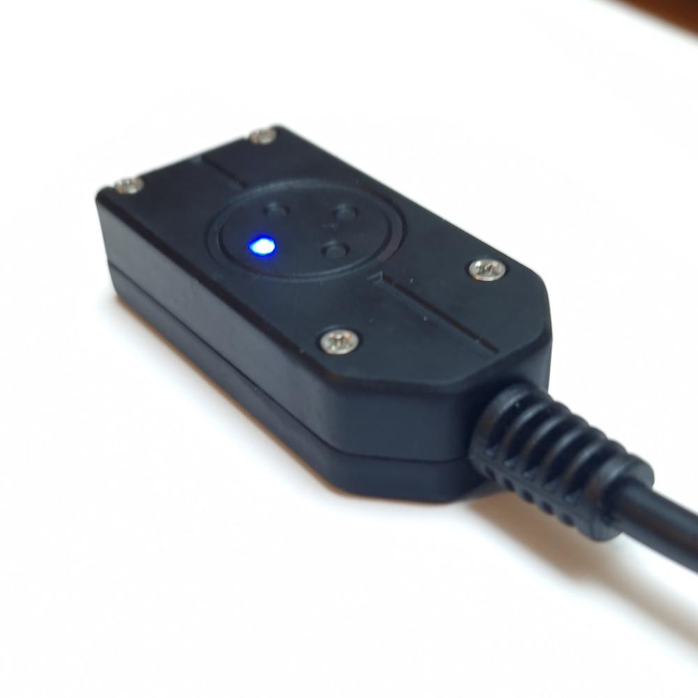

The "end-product" fully assembled and encased.

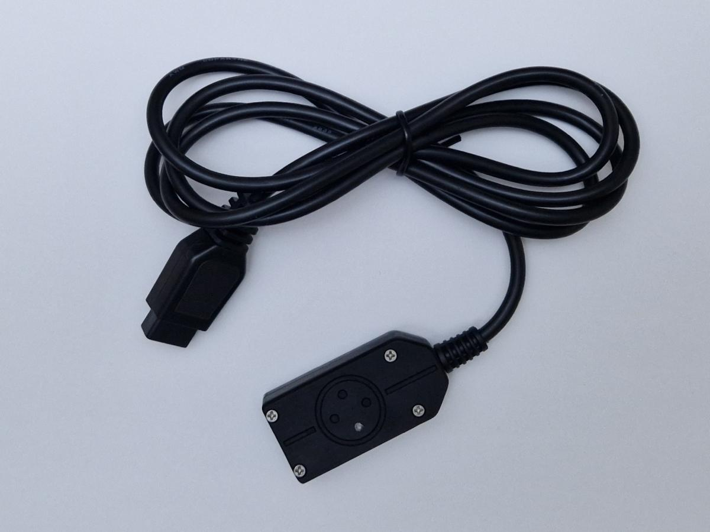

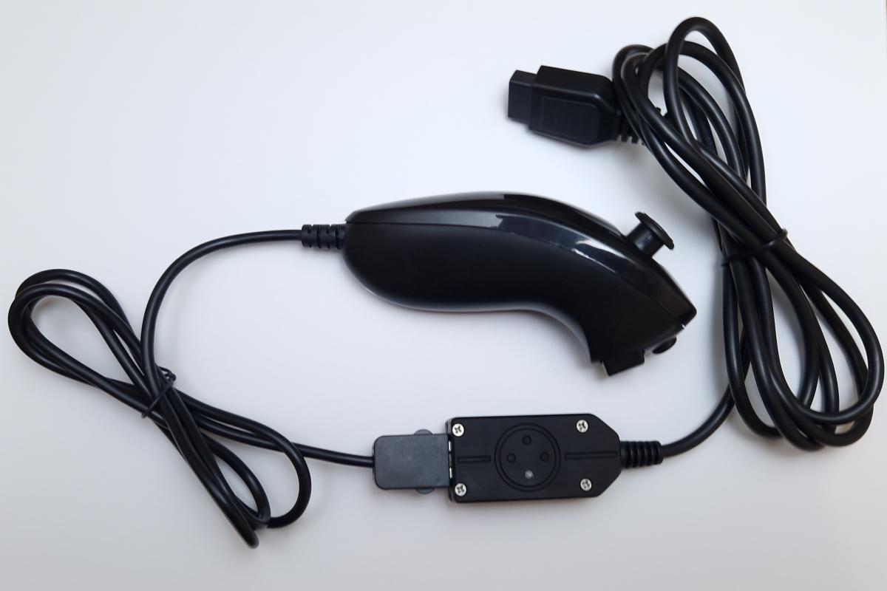

## Bill of material

Shipping is more expensive than the components.
Below table does not include the 4 bolts and nuts;
but I do now have spare PCBs and MOSFETs...

  | Item                                         | Quantity |Unit price| Total |Shipping | Example                                                       |
  |:---------------------------------------------|:--------:|:--------:|:-----:|:-------:|:--------------------------------------------------------------| 
  | ESP32-C3 SuperMini                           |     1    |  €2.90   | €2.90 |   €1.99 | [link](https://www.aliexpress.com/item/1005007539612437.html) |
  | BSS138 N-channel mosfet                      |     5    |  €0.0153 | €0.08 |   €1.99 | [link](https://www.aliexpress.com/item/1005004633792799.html) |
  | Sega Genesis 2 (Mega Drive 2) joystick cable |     1    |  €2.70   | €2.70 |   €1.99 | [link](https://www.aliexpress.com/item/1005006855342759.html) |
  | Nunchuk (clone)                              |     1    |  €4.59   | €4.59 |   €1.99 | [link](https://www.aliexpress.com/item/1005006424861864.html) |
  | PCB (JLCPCB)                                 |     1    |  €0.35   | €0.35 |   €6.62 |                                                               |
  | Enclosure (SLA at JLCPCB)                    |     1    |  €1.78   | €1.78 |   €1.33 |                                                               |
  |                                              |          |          |       |         |                                                               |
  |                                              |          |          |€12.40 |  €15.91 |                                                               |
  |                                              |          |          |       |  €28.31 |                                                               |

(end)

