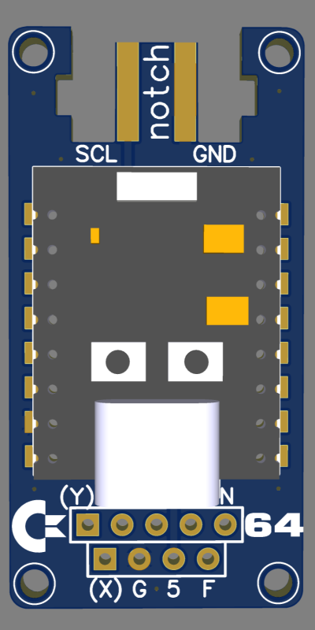
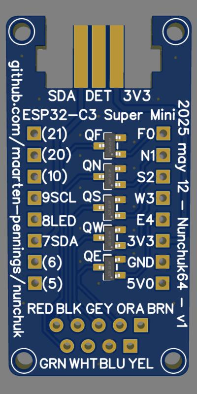
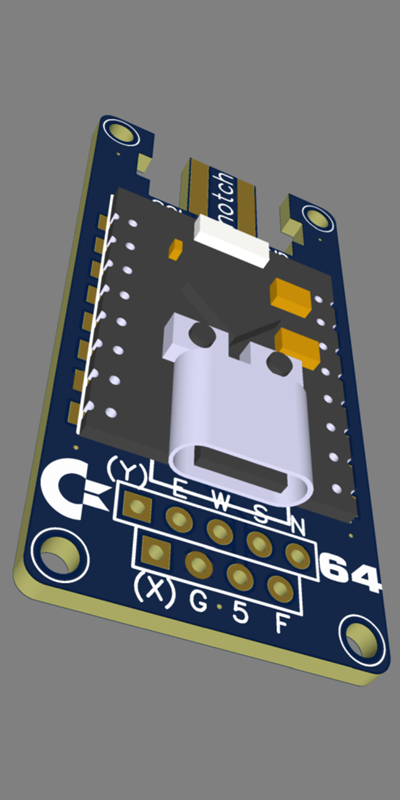

# Nunchuk64

I made an adapter enabling me to plug a Nunchuk into a Commodore 64.

## Micro controller

- I needed a micro controller on a small form factor PCB.
- It must be 3V3 to be compliant with the Nunchuk.
- It must have I2C. 
- It would be good if it had an on-board 5V to 3V3 regulator.
- It must have 5 output pins (in addition to the two I2C pins).
- A signaling LED would be nice.
- Arduino compatibility would be nice.

I picked the [ESP32-C3 SuperMini](https://www.aliexpress.com/item/1005007539612437.html).

This is the [firmware](../examples/nunchuk64).
At this moment C and Z both fire, maybe I'll make Z into an auto fire button.

## Schematics

The ESP32 obtains the JoyX and JoyY via I2C from the Nunchuk.
It also obtains the C and Z button status.

The  obtained values are mapped to 5 GPIO pins.

I used N-channel MOSFETS as level shifters to mimic a switch that connects one of the 5 joystick pins to ground.

This is the [schematics](Nunchuk64_schem.pdf) and the [EasyEDA sources](Nunchuk64_schem.json).

## Layout

I wanted the PCB to be small. Therefore, I placed the ESP on one side, and the MOSFETS on the other side of the PCB.

I'm not yet sure if I will solder the ESP board directly on my board (castellated pads).
Very likely I will raise it a bit to keep the USB connector reachable.

For the Nunchuk I used the trick I saw at [Adafruit](https://learn.adafruit.com/adafruit-wii-nunchuck-breakout-adapter).
I hope I got the dimensions correct.

Of course the C64 cable should attach to the PCB from one side, and the Nunchuk cable from the other side of the PCB.
Since I might want to reuse this PCB for a PC-Nunchuk adapter, the "PC cable" (USB) should be on the same side as the C64 cable.

This is the layout [front](Nunchuk64_pcb_front.pdf)/[back](Nunchuk64_pcb_back.pff) and the [EasyEDA sources](Nunchuk64_pcb.json).

Renders

  

## Gerber

This is the [Gerber](Nunchuk64_gerber.zip) I sent to [JLCPCB](https://jlcpcb.com/DMP)

(end)

