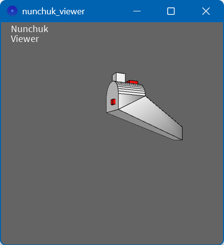

# Extras

Extras for this Arduino library

## Processing

There are two [Processing](https://processing.org/) sketches that go with the Arduino 
example [numchuck_dump](../examples/nunchuk_dump).
One shows a simple dashboard, the other a 3D model that moves with the real Nunchuk.

## Commodore 64 Nunchuk adapter

All files are available to make you own Nunchuk adapter for a C64.

Schematics, PCB (gerber), casing (STL) and BOM (bill of material).

See [pcb project](pcb). Associated firmware is the Arduino sketch example [numchuck64](../examples/nunchuk64).

(end)

