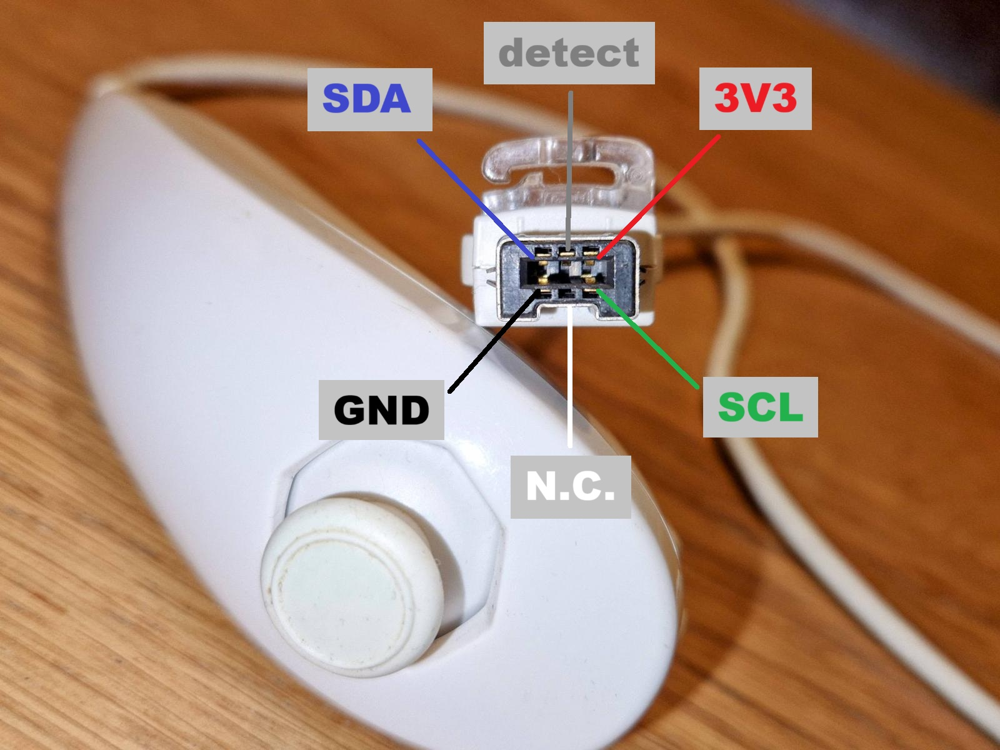
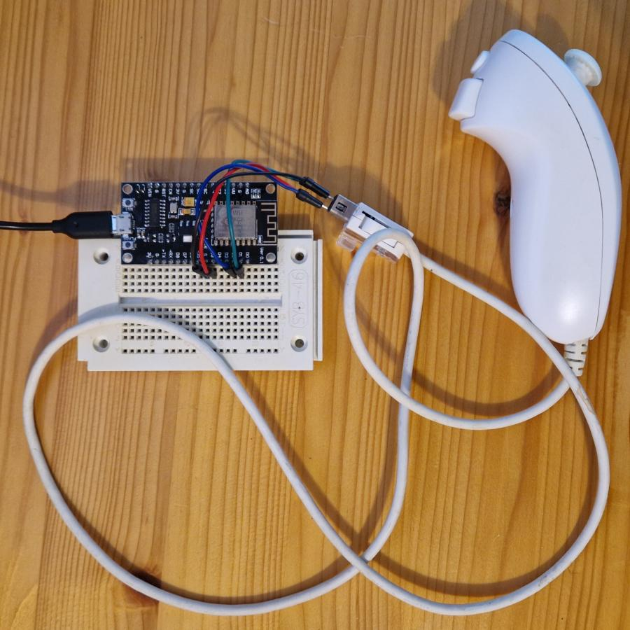

# Nunchuk

An Arduino library to control a Nunchuk.
It seems [Nunchuk](https://www.nintendo.com/en-gb/Support/Wii/Usage/Nunchuk/Set-Up-and-Use-of-the-Nunchuk/Nunchuk-244185.html) 
is the official spelling, not Nunchu_c_k.


## Introduction

I found out a Nunchuk is actually an I2C device.
It has I2C address 0x52 and accepts the fast protocol (100kHz).
It runs on 3.3V - although rumors has it that it works on 5V too.

The device needs hardly any writing, mostly just reading the sensors.
The Nunchuk has the following sensors:
 - The Z-button (1 bit)
 - The C-button (1 bit)
 - A potentiometer for the horizontal axis in the joystick (8 bit) 
 - A potentiometer for the vertical axis in the joystick (8 bit) 
 - An accelerometer in the X, Y, and Z direction (10 bit each)


Information from
 - [bootlin](https://bootlin.com/labs/doc/nunchuk.pdf)
 - [wiibre](https://wiibrew.org/wiki/Wiimote/Extension_Controllers/Nunchuck)
 - [WiiChuck](https://github.com/madhephaestus/WiiChuck)


## Clones

To my surprise clones are better in all (?) I2C aspects.

- My clone accepts 400kHz I2C, the real Nunchuk needs 100kHz.
- The joystick values of the clone use the full -128 to +127 range (not -104 to +86 of the real one).
- Also accelerometer meter range is reduced -192 to 197 for the real one (-512 to +511).
- An I2C read transaction needs a stop/start, clones accept the normal repeated-start.
- The real Nunchuk needs some delays between i2C transactions, my clone not.


## I2C device

The pin-out of the Nunchuk is not hard, but most drawings you find on the internet
don't tell whether you are looking at the plug of the Nunchuk or the outlet of the Wii controller.
To avoid all confusion, here a photo of the Nunchuk plug, with the meaning of the pins.
Also note the notch on the bottom side, ensuring the plug goes in one-way only.



The center pin at the bottom is not connected in my (Ali Express Nunchuk).
The center pin at the top is connected, rumor goes it is a device-detect pin.


```
  +-------+-------+-------+-------+-------+-------+-------+-------+-------+
  | Byte  | bit 7 | bit 6 | bit 5 | bit 4 | bit 3 | bit 2 | bit 1 | bit 0 |
  +-------+-------+-------+-------+-------+-------+-------+-------+-------+
  |   0   |                        joystick x [7:0]                       |
  |   1   |                        joystick y [7:0]                       |
  |   2   |                     accelerometer x [9:2]                     |
  |   3   |                     accelerometer y [9:2]                     |
  |   4   |                     accelerometer z [9:2]                     |
  |   5   | accel z [1:0] | accel y [1:0] | accel x [1:0] | but C | but Z |
  +-------+-------+-------+-------+-------+-------+-------+-------+-------+
  | Byte  | bit 7 | bit 6 | bit 5 | bit 4 | bit 3 | bit 2 | bit 1 | bit 0 |
  +-------+-------+-------+-------+-------+-------+-------+-------+-------+
```


## Images




(end)
  
  
  
