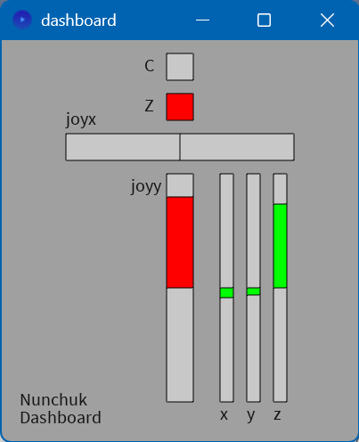
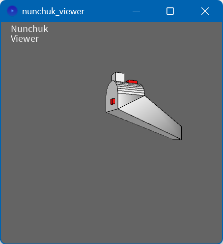
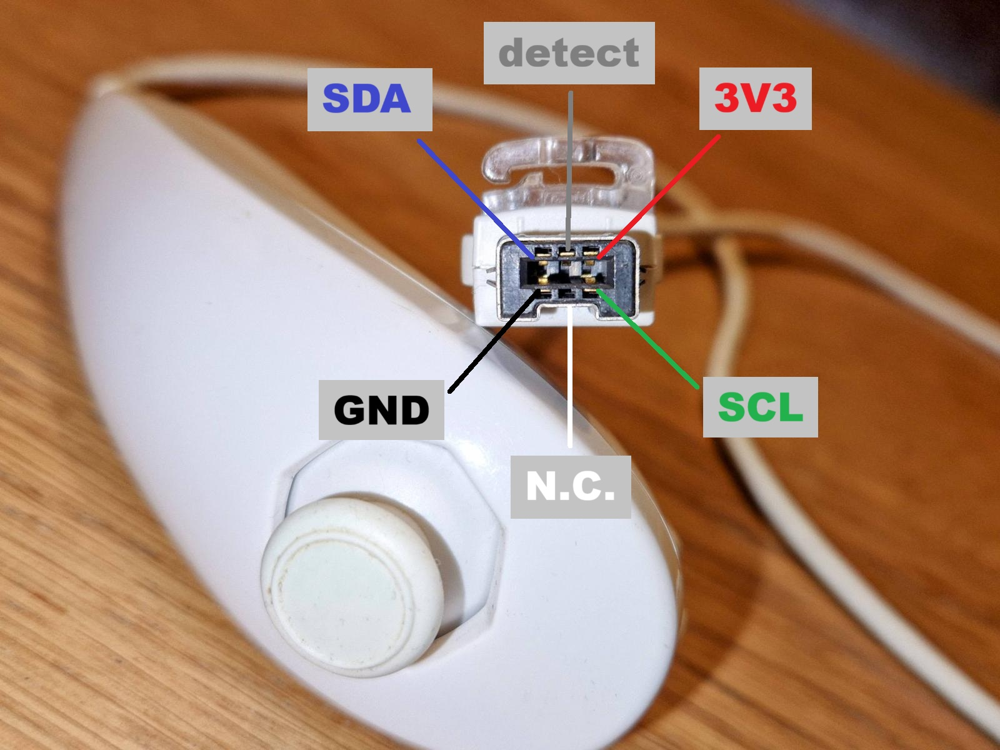
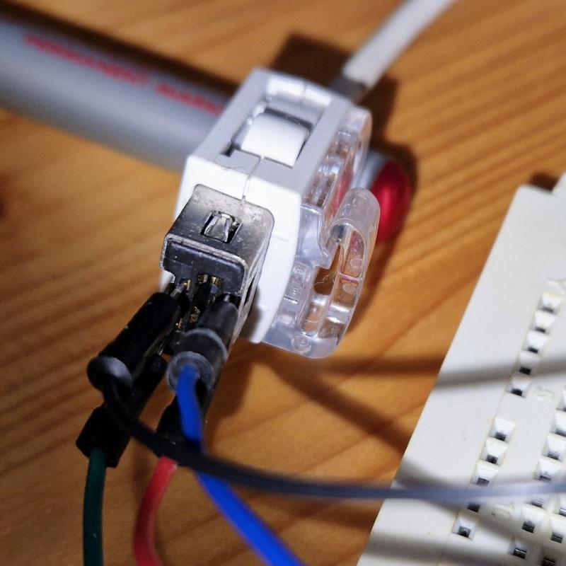
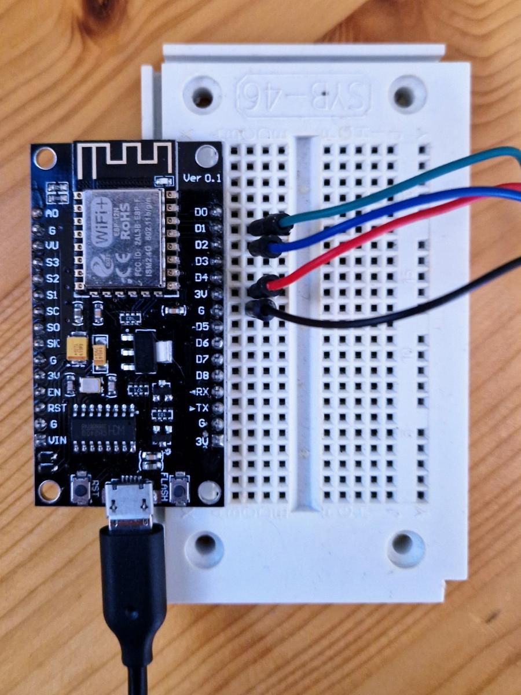
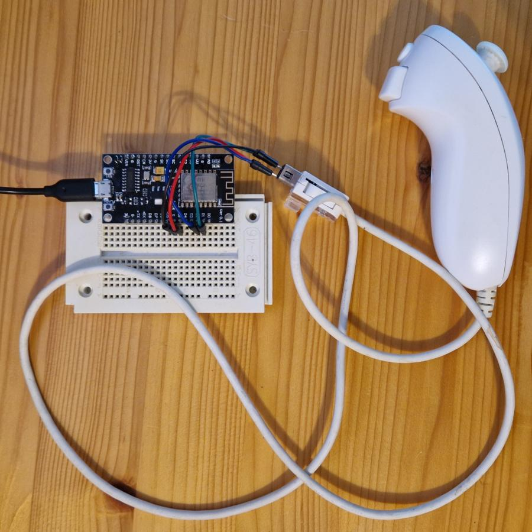
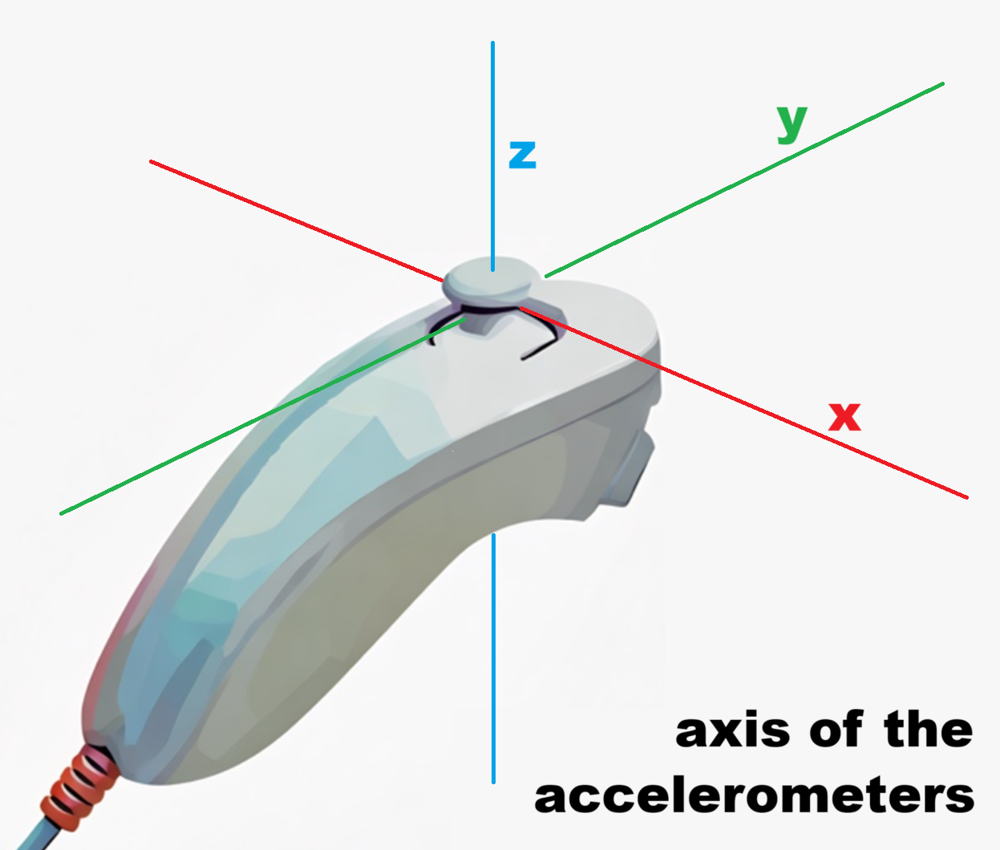
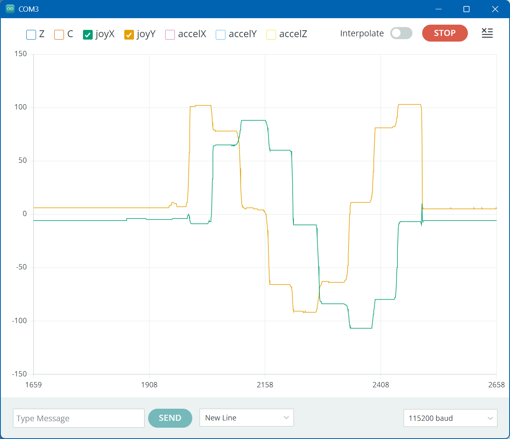

# Nunchuk

An Arduino library to control a Nunchuk.

> It seems [Nunchuk](https://www.nintendo.com/en-gb/Support/Wii/Usage/Nunchuk/Set-Up-and-Use-of-the-Nunchuk/Nunchuk-244185.html) is the official spelling, not Nunchu_c_k.

See a quick demo video with a [dashboard](https://youtu.be/O-drjiKqLoY) or with a [3D view](https://youtu.be/ZG64M4cBJL8).

[](https://youtu.be/O-drjiKqLoY) [](https://youtu.be/ZG64M4cBJL8)


## Introduction

I found out a Nunchuk is actually an I2C device.
It has I2C address 0x52 and uses the "standard-mode" bus speed (100kHz).
It runs on 3.3V - although rumors has it that (cloned?) Nunchuks work on 5V too.

The device needs hardly any I2C writes; controlling it mostly means just I2C reads for the sensors.
The Nunchuk has the following sensors:
 - The Z-button (1 bit).
 - The C-button (1 bit).
 - A potentiometer for the horizontal axis in the joystick (8 bit). 
 - A potentiometer for the vertical axis in the joystick (8 bit).
 - An accelerometer in the X, Y, and Z direction (10 bit each).


## Clones

You can use a real Nunchuk or get a [clone](https://www.aliexpress.com/item/1005006424861864.html)
for your experiments.

To my surprise my clone is better in _all_ (?) I2C aspects.

- It accepts "fast-mode" I2C bus speed (400kHz), the real Nunchuk needs 100kHz.
- The joystick values of my clone use the full -128 to +127 range (not -104 to +86 of the real one).
- Also the center position of the joystick is supposed to be 128; the clone is, the real one is off a bit.
- Also the accelerometer meter range of the real device is reduced -192 to 197 (it is 10 bit so one would expect -512 to +511).
- An I2C read needs two transactions stop/start and stop/start, my clone accepts the normal start/repeated-start/stop.
- The real Nunchuk needs some delays between I2C transactions, my clone not.


## Wiring

The pin-out of the Nunchuk is not hard, but most drawings you find on the internet
don't tell whether you are looking at the plug of the Nunchuk or the outlet of the Wii controller.
To avoid all confusion, here a photo of the Nunchuk plug, with the meaning of the pins.
Also note the notch on the bottom side, ensuring the plug goes in one-way only.



The center pin at the bottom is not connected in my (clone) Nunchuk.
The center pin at the top is connected, rumor goes it is a device-detect pin.
I did not connect it.

If you have thin jumper wires, you can try to fiddle the jumper wire in the outside holes.
For once that works better with the real Nunchuk, its holes are bigger.



For the clone, I was afraid I would damage the "springs" inside the connector, 
so I unscrewed the top of the connector and used clips instead of jumper wires.

The jumper wires are wired to a breadboard.
Safest is to use a 3V3 Arduino (not 5V), I opted for an ESP8266.
The wires from the Nunchuk go to power (red to 3V3 and black to GND)
and to I2C (blue to SDA, for ESP8266 pin D2 and green to SCL, for ESP8266 pin D1).



The whole setup looks like this.



By the way, Adafruit makes a nice breakout board, a simple [one](https://www.adafruit.com/product/345)
with just the mechanics, and an advanced [one](https://www.adafruit.com/product/4836) with their
I2C connector. More details cab be found on the [Adafruit website](https://learn.adafruit.com/adafruit-wii-nunchuck-breakout-adapter).


## Using the library

To use the library

- [Download](https://github.com/maarten-pennings/Nunchuk) and install it 
  in your Arduino library folder `C:\Users\<user>\Documents\Arduino\libraries\Nunchuk`.
  
- In your sketch include the library `#include <nunchuk.h>`.

- In `setup()` "begin" the driver with `nunchuk_begin()`.
  
  The function `nunchuk_begin()` returns `false` if initialization failed,
  so a possible call could be
  `if( !nunchuk_begin() ) Serial.println("Nunchuk begin failed");`.
    
  To make using the library easy, `nunchuk_begin()` also "begins" I2C.
  If you want to be in control of the I2C peripheral, e.g. because you do not use the default pins,
  you can "begin" I2C yourself and then pass it to `nunchuk_begin()`:
  
  ```C++
  #include <Wire.h>
  
  void setup() {
    ...
    Wire.begin(7/*sda*/, 9/*scl*/, 100*1000); // ESP32-C3 super mini, skipping SDA on pin 8 (it also has LED)
    if( !nunchuk_begin(&Wire) ) { Serial.println("Nunchuk begin failed"); delay(20000); }
    ...
  }
  ```

- In `loop()` (typically), call `nunchuk_scan()`. 
  This reads all sensor values from the Nunchuk into the Arduino.
  This needs to be repeated, to get fresh sensor data.
  A typical responsiveness of a UI is 100ms, so call `nunchuk_scan()` a factor more
  frequent.
  
- Once `nunchuk_scan()` is called the fresh sensor values can be obtained via the sensor functions:
  - Buttons: `nunchuk_buttonZ()` and `nunchuk_buttonC()`.
  - Joystick `nunchuk_joystickX()` and `nunchuk_joystickY()`.
  - The accelerometers `nunchuk_accelX()`, `nunchuk_accelY()`, and `nunchuk_accelZ()`.

- The accelerometer readouts are a bit jumpy (noisy).
  As an extra feature, the library contains a so called low-pass filter (LPF) to mittigate the noisyness.
  This feature compiutes a sort of an average of the last "n" measurements (for X, Y, and Z).
  
  To use the low pass filter, the averages needs to be updated; after each
  `nunchuk_scan()` call, also call `nunchuk_lpf(n)`. The parameter `n` must be between 0 and 1024,
  it defaults to 750. Next, use the ..lpf functions for the accelerometer data
  `nunchuk_accelXlpf()`, `nunchuk_accelYlpf()`, and `nunchuk_accelZlpf()`.
  
- The accelerometers measure the earth's G-force, so Nunchuk rotations around the 
  Z-axis, that is in the X/Y plane, can not be measured.

  
  
  Dangerous prototypes has a nice X-ray photo showing how the accelerometer chip is oriented.
  
  


## Examples

This library comes with a very basic [example](examples/nunchuk_dump) that just dumps all sensor readouts.
There are several ways to view those outputs.

- Most simple is to use the Serial monitor in the Arduino IDE: Open Tools > Serial Monitor.

  ```text
  Z:1 C:0 joyX:-19 joyY:101 accelX:0 accelY:-61 accelZ:186 
  Z:1 C:0 joyX:-19 joyY:101 accelX:0 accelY:-60 accelZ:186 
  Z:1 C:0 joyX:-19 joyY:101 accelX:1 accelY:-60 accelZ:186 
  Z:1 C:0 joyX:-19 joyY:101 accelX:1 accelY:-60 accelZ:186 
  Z:1 C:0 joyX:-19 joyY:101 accelX:2 accelY:-61 accelZ:186 
  Z:1 C:0 joyX:-19 joyY:101 accelX:1 accelY:-61 accelZ:185 
  Z:1 C:0 joyX:-19 joyY:101 accelX:0 accelY:-60 accelZ:185 
  Z:1 C:0 joyX:-19 joyY:102 accelX:0 accelY:-59 accelZ:185 
  Z:1 C:0 joyX:-19 joyY:102 accelX:-1 accelY:-59 accelZ:186 
  Z:1 C:0 joyX:-19 joyY:102 accelX:-1 accelY:-59 accelZ:186 
  Z:1 C:0 joyX:-18 joyY:102 accelX:-1 accelY:-59 accelZ:186 
  Z:1 C:0 joyX:-18 joyY:102 accelX:-1 accelY:-59 accelZ:186 
  ```
  
- A bit more advanced is to plot these number with the Serial plotter in the
  Arduino IDE: Open Tools > Serial Plotter. As of this date the Serial plotter has one
  shortcoming: the x-axis has a fixed length, which is too short.
  See this [patch](https://github.com/maarten-pennings/howto/blob/main/arduino2.0-wideplot/arduino2.0-wideplot.md)
  if you want it longer.
  
  Below is a screenshot of my plotter window, just showing the joystick X and Y, 
  while I moved the joystick in all 8 extreme positions.
  
  
  
- If you want a fancy view, download [Processing](https://processing.org/)
  a free graphics library and IDE, built for visual design. The _Processing_ language and IDE is
  the precursor to other projects including Arduino.

  Once installed, make sure the ESP8266 is running [nunchuk_dump.ino](examples/nunchuk_dump),
  the ESP8266 is connected (via USB) to the PC, the Arduino IDE (or any other tool) is not
  having the COM port open, and then start the [dashboard](extras/dashboard/dashboard.pde) I made,
  in Processing (if Processing is installed, a double click will do).
  
  

- The most fancy viewer, there is a second Processing visualization.
  Run the [Nunchuk viewer](extras/nunchuk_viewer) processing sketch.
  This draws the Nunchuk live, following its actual orientation, and even animating pressing on the buttons or the joystick.

  Again, have [nunchuk_dump.ino](examples/nunchuk_dump) running on the ESP8266 connected to the PC.

  

  
## Implementation notes

The Nunchuk device is rather simple to control.
Two writes are needed to "get started"; you find them in `nunchuk_begin()`.

Next the MCU needs to constantly poll the Nunchuk for the sensor data.
You find that in `nunchuk_scan()`. The block of sensor data thus retrieved is 6 bytes, 
and the values are allocated as shown in the table below.

```
  +-------+-------+-------+-------+-------+-------+-------+-------+-------+
  | Byte  | bit 7 | bit 6 | bit 5 | bit 4 | bit 3 | bit 2 | bit 1 | bit 0 |
  +-------+-------+-------+-------+-------+-------+-------+-------+-------+
  |   0   |                        joystick x [7:0]                       |
  |   1   |                        joystick y [7:0]                       |
  |   2   |                     accelerometer x [9:2]                     |
  |   3   |                     accelerometer y [9:2]                     |
  |   4   |                     accelerometer z [9:2]                     |
  |   5   | accel z [1:0] | accel y [1:0] | accel x [1:0] | but C | but Z |
  +-------+-------+-------+-------+-------+-------+-------+-------+-------+
  | Byte  | bit 7 | bit 6 | bit 5 | bit 4 | bit 3 | bit 2 | bit 1 | bit 0 |
  +-------+-------+-------+-------+-------+-------+-------+-------+-------+
```

Note 

- The two buttons (Z and C) are "low active".
  The driver inverts them, so `nunchuk_buttonZ()` and `nunchuk_buttonC()` return 1 when pressed.
  
- The joystick consists of two analogue potentiometers (for the "X" and "Y" axis).
  The I2C interface reports one byte for each axis. 
  The value 128 is supposed to be the center position; for the clone it is, the real Nunchuk is off a bit.
  The driver subtracts this 128 and reports a value between -128 and +127 for `nunchuk_joystickX()` and `nunchuk_joystickY()`.
  Not only is the center a bit off, also the (real) Nunchuk does not use the full range;
  mine uses -104 to +86 instead of -128 to +127.
  
- The accelerometers are 10 bits, the extra 2 bits are packed in byte 5.
  The value 512 is supposed to be the center position.
  The driver subtracts this 512 and reports a value between -512 and +511 for `nunchuk_accelX()`, 
  `nunchuk_accelY()`, and `nunchuk_accelZ()`.
  
- The low pass filter is a simple "first order lowpass filter" 
  ([ref](https://dsp.stackexchange.com/questions/39063/simple-software-low-pass-filter)).
  
- I was inspired by these sources
  - [bootlin](https://bootlin.com/labs/doc/nunchuk.pdf)
  - [wiibre](https://wiibrew.org/wiki/Wiimote/Extension_Controllers/Nunchuck)
  - [WiiChuck](https://github.com/madhephaestus/WiiChuck)


(end)
